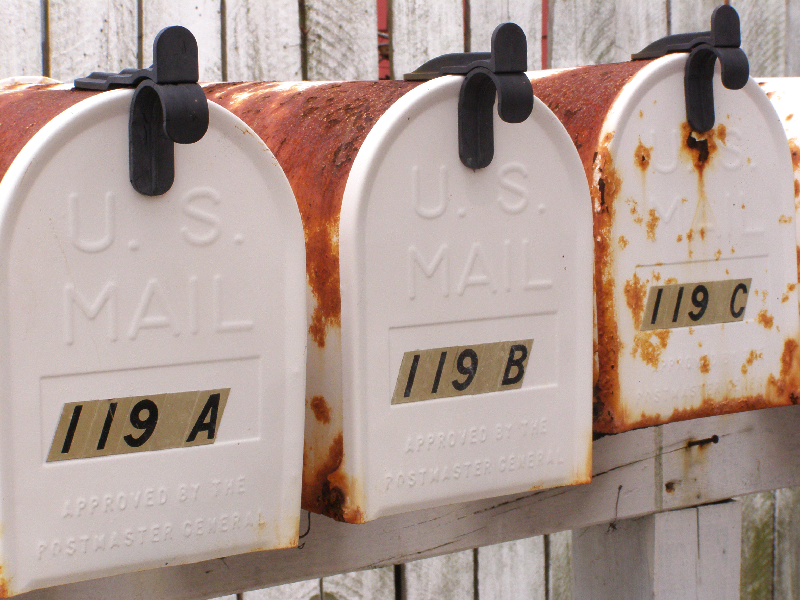
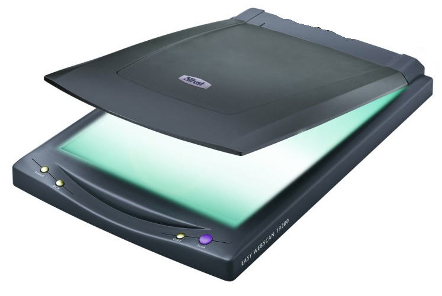
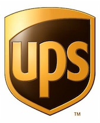
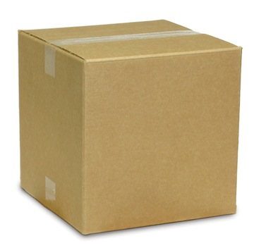

!SLIDE center incremental transition=scrollup

## Tools For Getting Things Done
## Presented by: Jean-Paul S. Boodhoo

!SLIDE center bullets incremental

# What we will cover today

* 
* 
* 
* 

!SLIDE center bullets incremental

#Earth Class Mail 

* Global Digital Mail Handling Service
* [Web Based Mail Management](http://www.earthclassmail.com)
* Pricing - $19.95/month - $39.95/month - approximately
* The main mail service I have used for the last 3 years!!

!SLIDE

#Main Features

!SLIDE center

#Mail Receipt

!SLIDE center

#Mail Scanning

!SLIDE center

#Email Based Mail Delivery

  

!SLIDE center

#Package Shipment

 

!SLIDE center

#Earth Class Mail Demo

